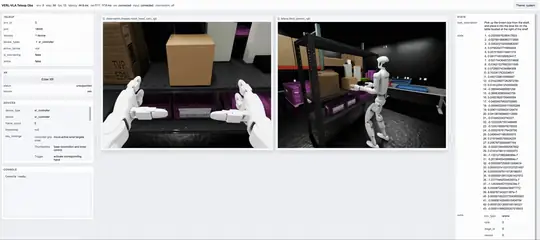
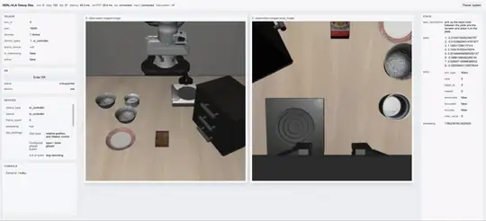
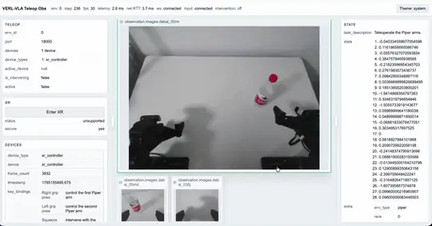

# verl-vla

[](https://verl-vla.readthedocs.io/en/latest/)&nbsp;[](https://github.com/verl-project/verl-vla/actions/workflows/sanity.yml)&nbsp;[](LICENSE)&nbsp;[](https://www.python.org/)

**A unified post-training framework for vision-language-action policies, built
on top of [verl](https://github.com/verl-project/verl).**

verl-vla unifies human-in-the-loop data collection, fine-tuning, and
reinforcement learning in a single post-training workflow. Its shared execution
architecture allows models, environments, and training algorithms to be
integrated independently and composed as needed. Together with a growing
collection of reproducible recipes, verl-vla aims to accelerate the deployment
of VLA models in real-world applications.

Training workers, simulators, and physical robots may run on different nodes
according to their hardware and connectivity requirements. Operators can
monitor, teleoperate, and intervene in execution from any connected device, as
shown below across simulators and physical robots:

<table>
  <tr>
    <th>Isaac Lab Arena</th>
    <th>LIBERO</th>
    <th>Piper</th>
  </tr>
  <tr>
    <td></td>
    <td></td>
    <td></td>
  </tr>
</table>

[Documentation](https://verl-vla.readthedocs.io/en/latest/) ·
[Quick Start](https://verl-vla.readthedocs.io/en/latest/getting-started/) ·
[Framework Overview](https://verl-vla.readthedocs.io/en/latest/framework-overview/)

## Highlights

- **One post-training lifecycle:** move from demonstrations and supervised
  fine-tuning into evaluation, reinforcement learning, and human intervention
  without rebuilding the execution pipeline.
- **Flexible distributed deployment:** use `TrainCluster` to coordinate
  training, rollout, environments, resources, checkpoints, and model
  synchronization across heterogeneous topologies—from models and simulators
  running on multi-node cloud clusters to physical robots operating on local
  machines—all through a compact API.
- **Fast model and environment integration:** preserve each upstream model's
  native implementation and checkpoint format while connecting it through a
  lightweight adapter, and integrate new simulators or physical robots through
  a concise, unified environment API with operations such as `reset` and
  `step`.
- **Reproducible recipes:** start from documented, end-to-end recipes with
  verified environments and minimal launchers, then adapt the same workflows
  to deploy post-training in your own models, environments, and robot setups.
- **Human-in-the-loop operation:** teleoperate environments, intervene in
  policy execution, and record demonstrations, autonomous rollouts, and
  intervention data through the same environment loop.
- **Web-based visualization and control:** monitor observations, environment
  state, and runtime metrics in real time, then teleoperate or intervene
  directly from a browser on any connected device.

## How it works


A workflow defines the end-to-end procedure, a trainer advances the selected
algorithm, and `TrainCluster` coordinates the distributed workers that execute
model and environment operations. This separation lets the same model,
environment, and resource topology be reused across data collection,
fine-tuning, reinforcement learning, and evaluation.

The repository currently includes integrations and runnable examples for:

| Area | Integrations |
| --- | --- |
| Models | ACT, Gaussian actor, Pi0.5, and GR00T N1.6 |
| Environments and robots | LIBERO, Isaac Lab Arena, and Piper |
| Training | SFT, SAC-style off-policy training, DSRL, and RECAP |
| Human input | Keyboard, gamepad, XR controller, and LeRobot leader arm |

Support for additional models, environments, training algorithms, and input
devices is under active development.

## Quick start

The following minimal example lets you quickly experience verl-vla's
browser-based teleoperation workflow. After completing the
[environment setup](https://verl-vla.readthedocs.io/en/latest/getting-started/#set-up-the-environment),
activate the local environment and start keyboard teleoperation on the first
LIBERO Spatial task:

```bash
source .venv/bin/activate

vvla-teleop \
  cluster.env.env_worker.simulator.libero.task_suite_name=libero_spatial \
  cluster.env.env_worker.simulator.libero.task_ids='[0]' \
  cluster.env.env_worker.teleop.devices='[keyboard]'
```

Open [http://localhost:18000](http://localhost:18000) to view the live
teleoperation dashboard. If LIBERO is running on another machine, replace
`localhost` with that machine's hostname or IP address.

Follow the keyboard controls shown in the dashboard to operate the robot arm.
Press Enter to reset the environment and Ctrl+C in the terminal to stop.

Continue with the full
[Quick Start](https://verl-vla.readthedocs.io/en/latest/getting-started/) to
record and replay demonstrations, fine-tune an ACT policy, evaluate it, and
collect additional trajectories with optional human intervention. The guide
also provides an OSMesa CPU-rendering command for machines without a rendering
GPU.

## Documentation

| Guide | What it covers |
| --- | --- |
| [Quick Start](https://verl-vla.readthedocs.io/en/latest/getting-started/) | An end-to-end LIBERO workflow from teleoperation to training and evaluation |
| [Framework Overview](https://verl-vla.readthedocs.io/en/latest/framework-overview/) | Architecture, workflows, trainers, `TrainCluster`, integrations, and resource configuration |
| [Data Collection](https://verl-vla.readthedocs.io/en/latest/data-collection/) | Environment installation and device-specific teleoperation, recording, and intervention examples |
| [Fine-Tuning](https://verl-vla.readthedocs.io/en/latest/fine-tuning/) | Reproducible supervised fine-tuning workflows |
| [Reinforcement Learning](https://verl-vla.readthedocs.io/en/latest/reinforcement-learning/) | Reinforcement learning workflows and examples |

## Contributing

We warmly welcome contributions. Valuable improvements of any kind, as well as
meaningful and reproducible experiments, can help more people bring embodied
models into real-world applications. If you encounter a problem or have an
idea for a new model, environment, device, training workflow, or experiment,
please open a
[GitHub issue](https://github.com/verl-project/verl-vla/issues). See
[CONTRIBUTING.md](CONTRIBUTING.md) for contribution guidelines.

## Acknowledgements

verl-vla is built on [verl](https://github.com/verl-project/verl), extending
its distributed training infrastructure for robotics and VLA post-training.
We sincerely thank the verl team for their foundational work and continued
support for this project.

We are grateful to [LeRobot](https://github.com/huggingface/lerobot),
[SimpleVLA-RL](https://github.com/PRIME-RL/SimpleVLA-RL),
[RLinf](https://github.com/RLinf/RLinf),
[DSRL](https://github.com/ajwagen/dsrl),
[Giga Models](https://github.com/open-gigaai/giga-models),
[OpenPI](https://github.com/Physical-Intelligence/openpi),
[Evo-RL](https://github.com/MINT-SJTU/Evo-RL), and
[Evo-RLT](https://github.com/MINT-SJTU/Evo-RLT) for the ideas, implementations,
and open-source foundations that helped shape this project. In particular,
verl-vla's user-facing data and device APIs are organized with reference to
LeRobot's elegant API design.

We owe special thanks to the
[Isaac Lab Arena](https://github.com/isaac-sim/IsaacLab-Arena) and
[NVIDIA Isaac Lab](https://github.com/isaac-sim/IsaacLab) projects and teams,
whose substantial contributions and close support have been instrumental to
verl-vla.

## License

verl-vla is licensed under the [Apache License 2.0](LICENSE).
