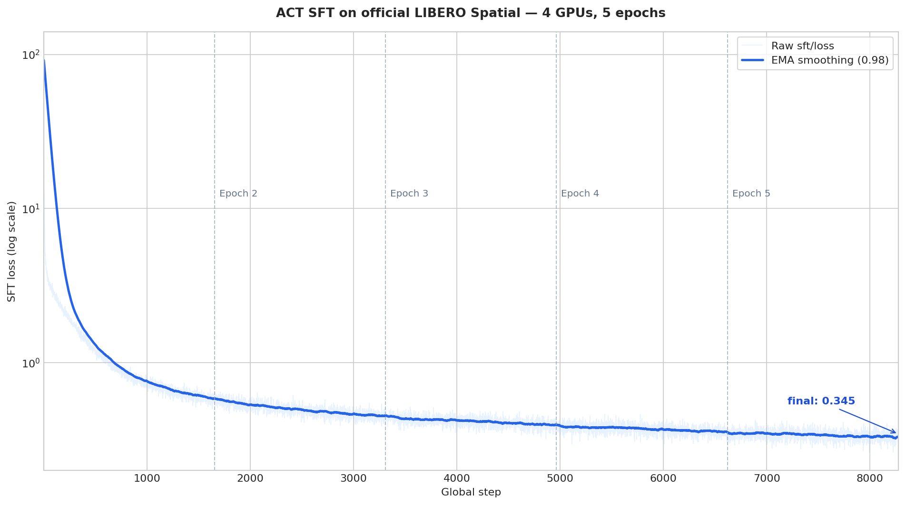

# Fine-tune ACT on the official LIBERO Spatial dataset

This recipe fine-tunes an ACT policy on the official
[`lerobot/libero_spatial_image`](https://huggingface.co/datasets/lerobot/libero_spatial_image)
dataset and evaluates the resulting policy across the LIBERO Spatial suite.

## Setup

| Component | Configuration |
| --- | --- |
| Policy | Native ACT, initialized from `assets/hf_models/act_libero` |
| Training data | Official LeRobot LIBERO Spatial demonstrations |
| Dataset identity | `lerobot/libero_spatial_image` |
| Dataset size | 432 episodes, 52,970 frames, 10 tasks |
| Embodiment | LIBERO Franka/Panda |
| Evaluation environment | LIBERO Spatial, all 10 tasks |
| Default training resources | One CUDA-capable NVIDIA GPU |
| Action horizon | 10 steps |
| Output root | `./outputs/train/act-sft/official-libero-spatial` |

The initializer defines the ACT architecture but contains no policy weights.
It loads an ImageNet-pretrained ResNet18 backbone and randomly initializes the
remaining parameters.

## Prepare the environment

Use the environment from the
[Quick Start](../../getting-started/index.md), including its installation
checks. ACT training requires a CUDA-capable NVIDIA GPU. Evaluation also uses
the LIBERO simulator installed by that environment.

## Prepare the dataset

The training launcher downloads the official dataset automatically to:

```text
./.data/act_sft/datasets/libero_spatial_image
```

The dataset already includes the LeRobot statistics needed to initialize the
native ACT processors. No additional statistics file needs to be generated.

### Dataset contract

| Feature | Official dataset | ACT input |
| --- | --- | --- |
| `observation.images.image` | RGB `uint8`, `(256, 256, 3)`, `[0, 255]` | `float32`, `(3, 256, 256)`, `[0, 1]` |
| `observation.images.wrist_image` | RGB `uint8`, `(256, 256, 3)`, `[0, 255]` | `float32`, `(3, 256, 256)`, `[0, 1]` |
| `observation.state` | `float32`, `(8,)` | `float32`, `(8,)` |
| `action` | `float32`, `(7,)` | `float32`, `(7,)` |
| `task` | Text | Text |

LeRobot decodes the RGB frames and converts them to channel-first `float32`
tensors before they reach ACT. The initializer uses a 10-step action chunk, so
the recipe requests 10 consecutive actions from the dataset.

## Configure training

The recipe uses
`examples/fine_tuning/act/official_libero_spatial/act_sft.yaml`, which selects
the shared SFT workflow, ACT model, and LIBERO adapter. The launcher provides
these defaults:

| Setting | Default | Purpose |
| --- | --- | --- |
| `data.repo_id` | `lerobot/libero_spatial_image` | Logical LeRobot dataset identity |
| `data.root` | `./.data/act_sft/datasets/libero_spatial_image` | Dataset frames and processor statistics |
| `cluster.actor_rollout_ref.model.adapter.processor_dataset_root` | `${data.root}` | Statistics used to initialize native ACT processors |
| `data.batch_size` | `32` | Global DataLoader batch size |
| `cluster.actor_rollout_ref.actor.mini_batch_size` | `32` | Actor mini-batch size |
| `cluster.actor_rollout_ref.actor.micro_batch_size` | `16` | Per-device micro-batch size |
| `cluster.actor_rollout_ref.actor.optim.lr` | `1e-4` | Learning rate |
| `trainer.total_epochs` | `5` | Number of full dataset passes |
| `cluster.resource.model.gpus_per_node` | `1` | GPUs used for training |
| `trainer.save_freq` | `500` | Checkpoint interval in optimizer steps |

If the machine supports multi-GPU training, increase the GPU count:

```bash
bash examples/fine_tuning/act/official_libero_spatial/run_train.sh \
  cluster.resource.model.gpus_per_node=4
```

The global `data.batch_size` must be divisible by the number of training GPUs.

## Start training

Run the recipe from the repository root:

```bash
bash examples/fine_tuning/act/official_libero_spatial/run_train.sh
```

The launcher downloads any missing dataset files before starting training.
Checkpoints are written to:

```text
./outputs/train/act-sft/official-libero-spatial/checkpoints
```

`latest_checkpointed_iteration.txt` records the latest step. Running the
training command again resumes from that checkpoint, including optimizer and
dataloader state.

### Monitor training

The console reports `sft/loss`, gradient norm, epoch, and timing metrics.
TensorBoard event files are written to:

```text
./outputs/train/act-sft/official-libero-spatial/tensorboard
```

Start TensorBoard in another terminal:

```bash
tensorboard \
  --logdir "./outputs/train/act-sft/official-libero-spatial/tensorboard" \
  --bind_all \
  --port 6006
```

Open `http://localhost:6006`. The supervised loss measures how well the policy
fits the demonstrations; closed-loop success is measured by the LIBERO
evaluation below.

### Reference training result

The reference run trained for 5 epochs on 4 GPUs and completed 8,275 optimizer
steps. Its SFT loss decreased from 91.716 to 0.345:



## Evaluate in LIBERO

The evaluation launcher resolves the latest native ACT export automatically:

```bash
bash examples/fine_tuning/act/official_libero_spatial/run_eval.sh
```

By default, it evaluates 10 reset states for each of the 10 LIBERO Spatial
tasks. Results are written under a directory named for the evaluated training
step:

```text
./outputs/eval/act-sft/official-libero-spatial/step-<N>/
├── metrics.json
└── videos/
```

Inspect `metrics.json` for the overall and per-task success rates. Use the
videos to review successful rollouts and diagnose failures.

### Reference evaluation result

The checkpoint from the reference run was evaluated on all 10 tasks with 10
trials per task:

| Metric | Value |
| --- | ---: |
| Checkpoint step | 8,275 |
| Tasks | 10 |
| Trials per task | 10 |
| Successful trajectories | 85 / 100 |
| Success rate | 85% |
| Average return | 0.85 |

| Task | Successful trials | Success rate |
| --- | ---: | ---: |
| 0 | 10 / 10 | 100% |
| 1 | 9 / 10 | 90% |
| 2 | 9 / 10 | 90% |
| 3 | 9 / 10 | 90% |
| 4 | 9 / 10 | 90% |
| 5 | 10 / 10 | 100% |
| 6 | 10 / 10 | 100% |
| 7 | 6 / 10 | 60% |
| 8 | 8 / 10 | 80% |
| 9 | 5 / 10 | 50% |

The
[complete evaluation metrics](../../_static/results/act-official-libero-spatial-eval.json)
include per-task counts, trajectory lengths, timing, and throughput.
