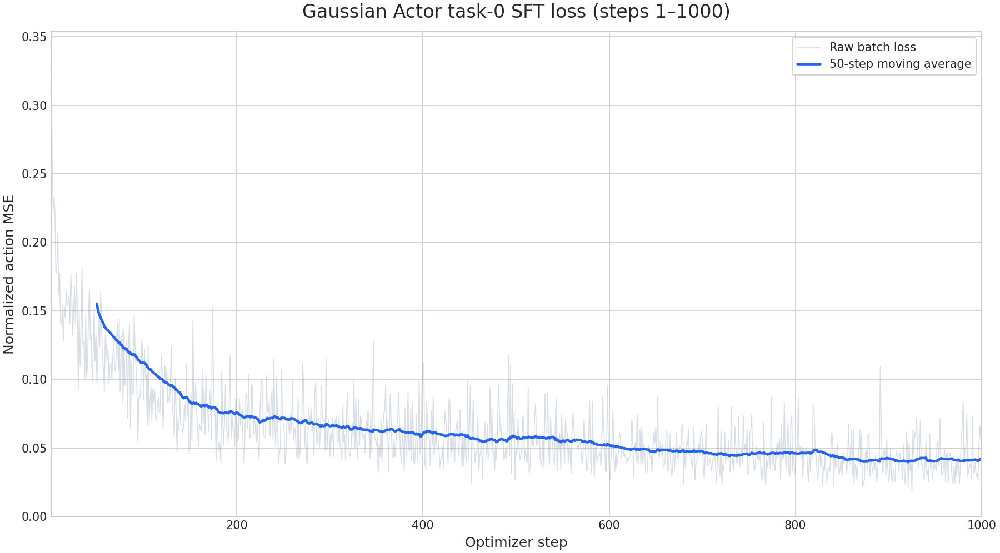
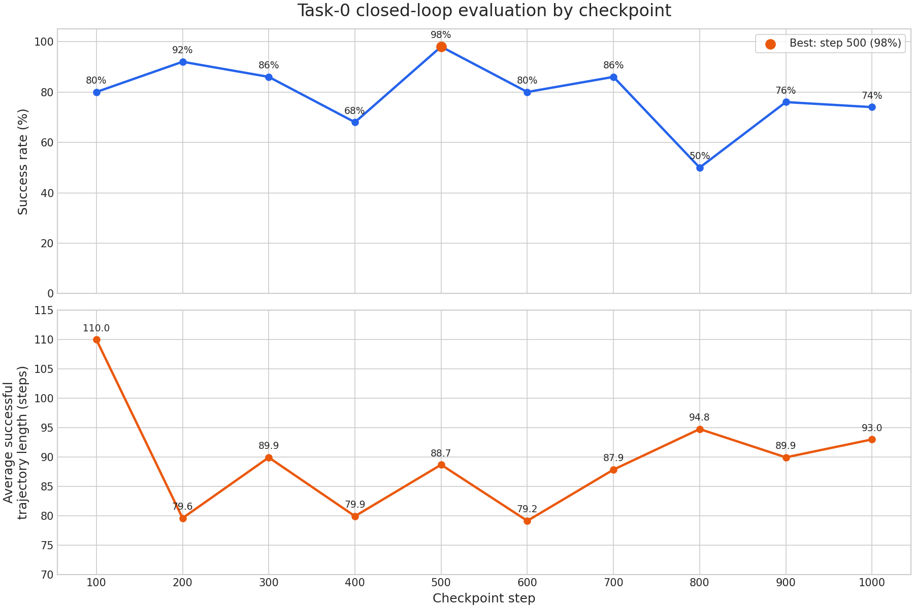
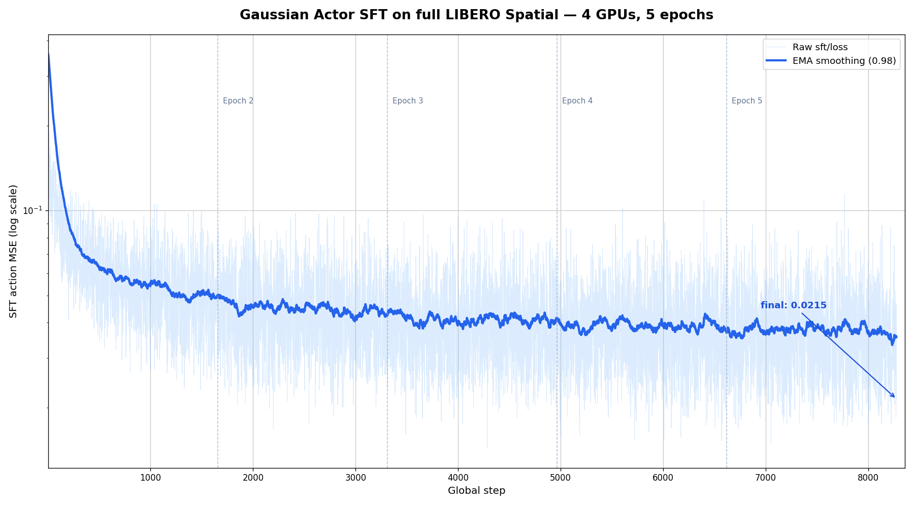

# Fine-tune Gaussian Actor on the first LIBERO Spatial task

This recipe fine-tunes the native LeRobot Gaussian Actor on the first task in
the canonical LIBERO Spatial benchmark and evaluates all 50 official reset
states for that task.

## Setup

| Component | Configuration |
| --- | --- |
| Policy | Native LeRobot Gaussian Actor |
| Initializer | `assets/hf_models/gaussian_actor_libero` |
| Training data | [`Miical/libero_spatial_image_task0`](https://huggingface.co/datasets/Miical/libero_spatial_image_task0) |
| Dataset size | 45 episodes, 4,487 frames, one task |
| Canonical LIBERO task ID | `0` |
| Embodiment | LIBERO Franka/Panda |
| Evaluation | All 50 official reset states, 256-step horizon |
| Default training resources | One CUDA-capable NVIDIA GPU, FSDP2 |
| Action horizon | One step |
| Output root | `./outputs/train/gaussian-actor-sft/libero-spatial-task0-step-sweep` |

The policy consumes the agent-view image, wrist image, and 8-dimensional robot
state. It predicts the mean of one 7-dimensional continuous action. During SFT,
one MSE is computed over all seven action dimensions and the standard-deviation
head remains fixed. The initializer has no pretrained visual backbone, so this
recipe trains its CNN instead of freezing random visual features.

The training export remains a native Hugging Face/LeRobot artifact. It can be
loaded by the upstream Gaussian Actor implementation without converting it to
a verl-vla-specific checkpoint format.

## Prepare the environment

Use the environment from the
[Quick Start](../../getting-started/index.md), including its installation
checks. Training requires one CUDA-capable NVIDIA GPU. The reference evaluation
uses four GPUs: two model workers and two EGL-rendered environment workers.

## Prepare the dataset

The training launcher downloads the single-task dataset automatically to:

```text
./.data/gaussian_actor_sft/datasets/libero_spatial_image_task0
```

This dataset is derived from
[`lerobot/libero_spatial_image`](https://huggingface.co/datasets/lerobot/libero_spatial_image).
The source dataset stores the same instruction at its local `task_index=4`,
while the LIBERO benchmark identifies it as canonical `task_id=0`. The derived
dataset selects episodes by exact task description, rebuilds contiguous
indices, and includes recomputed global image statistics.

### Dataset contract

| Feature | Dataset value | Gaussian Actor input |
| --- | --- | --- |
| `observation.images.image` | RGB `uint8`, `(256, 256, 3)`, `[0, 255]` | normalized `float32`, `(3, 256, 256)` |
| `observation.images.wrist_image` | RGB `uint8`, `(256, 256, 3)`, `[0, 255]` | normalized `float32`, `(3, 256, 256)` |
| `observation.state` | `float32`, `(8,)` | min-max normalized `float32`, `(8,)` |
| `action` | `float32`, `(7,)` | min-max normalized `float32`, `(7,)` |

LeRobot decodes images into channel-first `[0, 1]` tensors before the saved
processor applies mean-standard-deviation normalization. Do not divide the
decoded tensors by 255 a second time.

## Configure training

The recipe uses
`examples/fine_tuning/gaussian_actor/libero_spatial_task0/gaussian_actor_sft.yaml`,
which selects the shared SFT workflow, Gaussian Actor adapter, and FSDP2 worker.
The launcher provides the settings validated by the reference run:

| Setting | Default | Purpose |
| --- | ---: | --- |
| `data.batch_size` | `32` | Global DataLoader batch size |
| `cluster.actor_rollout_ref.actor.mini_batch_size` | `32` | Actor mini-batch size |
| `cluster.actor_rollout_ref.actor.micro_batch_size` | `16` | Per-device micro-batch size |
| `cluster.actor_rollout_ref.actor.optim.lr` | `1e-4` | Learning rate |
| `trainer.total_epochs` | `8` | Produces 1,120 optimizer steps on the reference dataset |
| `cluster.resource.model.gpus_per_node` | `1` | Training GPUs |
| `data.action_delta_steps` | `1` | One action target per observation |
| `trainer.save_freq` | `100` | Checkpoint interval used by the evaluation sweep |

## Start training

Run from the repository root:

```bash
bash examples/fine_tuning/gaussian_actor/libero_spatial_task0/run_train.sh
```

The launcher downloads missing data and resumes automatically when its output
root already contains a checkpoint. Eight epochs produce 1,120 optimizer steps;
the reference analysis below compares checkpoints from step 100 through step
1,000. Native policy exports are written under:

```text
./outputs/train/gaussian-actor-sft/libero-spatial-task0-step-sweep/checkpoints/global_step_<N>/actor/huggingface
```

### Monitor training

TensorBoard event files are written to:

```text
./outputs/train/gaussian-actor-sft/libero-spatial-task0-step-sweep/tensorboard
```

Start TensorBoard in another terminal:

```bash
tensorboard \
  --logdir "./outputs/train/gaussian-actor-sft/libero-spatial-task0-step-sweep/tensorboard" \
  --bind_all \
  --port 6006
```

Open `http://localhost:6006`. The relevant supervised metric is `sft/loss`,
which is the normalized one-step action MSE.

### Reference training result

The reference run used one GPU with FSDP2 for eight epochs and completed 1,120
optimizer steps. Over the first 1,000 steps, raw SFT loss decreased from 0.3377
to 0.03690. The mean loss over steps 901–1,000 was 0.04121, and the minimum
individual batch loss was 0.01828.



## Evaluate in LIBERO

The evaluation launcher selects the verified step-500 native policy export and
runs the complete 50-state task benchmark:

```bash
bash examples/fine_tuning/gaussian_actor/libero_spatial_task0/run_eval.sh
```

Its verified defaults are a 256-step horizon, two model GPUs, two EGL-rendered
environment GPUs, 64 concurrent environments, and 100 interactions per
environment loop. Set `CHECKPOINT_STEP` to evaluate another saved checkpoint.
Metrics and videos are written to:

```text
./outputs/eval/gaussian-actor-sft/libero-spatial-task0-step-sweep/step-<N>-task0-50x256-2m2e64-i100/
├── metrics.json
└── videos/
```

### Reference evaluation sweep

Every checkpoint from step 100 through step 1,000 was evaluated on the same 50
official reset states. The curves report the success rate and the mean episode
length over successful trajectories; failed trajectories are not included in
the length average.



| Checkpoint step | Successful trials | Success rate | Average successful trajectory length |
| ---: | ---: | ---: | ---: |
| 100 | 40 / 50 | 80% | 109.98 |
| 200 | 46 / 50 | 92% | 79.61 |
| 300 | 43 / 50 | 86% | 89.93 |
| 400 | 34 / 50 | 68% | 79.94 |
| **500** | **49 / 50** | **98%** | **88.69** |
| 600 | 40 / 50 | 80% | 79.15 |
| 700 | 43 / 50 | 86% | 87.86 |
| 800 | 25 / 50 | 50% | 94.76 |
| 900 | 38 / 50 | 76% | 89.95 |
| 1,000 | 37 / 50 | 74% | 93.00 |

Step 500 is the reference checkpoint. A second complete run reproduced exactly
49/50 success and the same 88.69-step average successful trajectory length.
The later checkpoints show that lower action MSE does not imply monotonically
better closed-loop control, so select checkpoints with the complete rollout
benchmark rather than training loss alone.

## Full-dataset experiment

We also trained the same Gaussian Actor on the complete official LIBERO Spatial
dataset with a global batch size of 32, a `1e-4` learning rate, five epochs,
four training GPUs, and `action_delta_steps=1`.

The full run completed 8,275 optimizer steps. Its raw SFT loss decreased from
0.3585 to 0.02147, so the offline loss looked comparable to the successful
single-task run:



Closed-loop evaluation used all 10 tasks with 10 trials per task, a 256-step
horizon, two model GPUs, and two EGL-rendered environment GPUs:

| Canonical task ID | Successful trials | Success rate |
| --- | ---: | ---: |
| 0 | 0 / 10 | 0% |
| 1 | 1 / 10 | 10% |
| 2 | 0 / 10 | 0% |
| 3 | 0 / 10 | 0% |
| 4 | 0 / 10 | 0% |
| 5 | 0 / 10 | 0% |
| 6 | 0 / 10 | 0% |
| 7 | 0 / 10 | 0% |
| 8 | 0 / 10 | 0% |
| 9 | 0 / 10 | 0% |
| **Overall** | **1 / 100** | **1%** |

This result is poor despite the low aggregate SFT loss. On the same complete
dataset, the ACT reference recipe reaches 85/100 while this Gaussian Actor
reaches only 1/100. Combined with its 49/50 single-task result, the evidence
shows that the current compact, one-step Gaussian Actor can fit one task but
does not fit the complete 10-task data distribution with this SFT setup. The
low averaged action MSE is therefore not sufficient evidence of a useful
multi-task policy; it can hide task-critical prediction errors. This is a
model-fitting limitation relative to ACT, not evidence that language or task-ID
conditioning is required.
