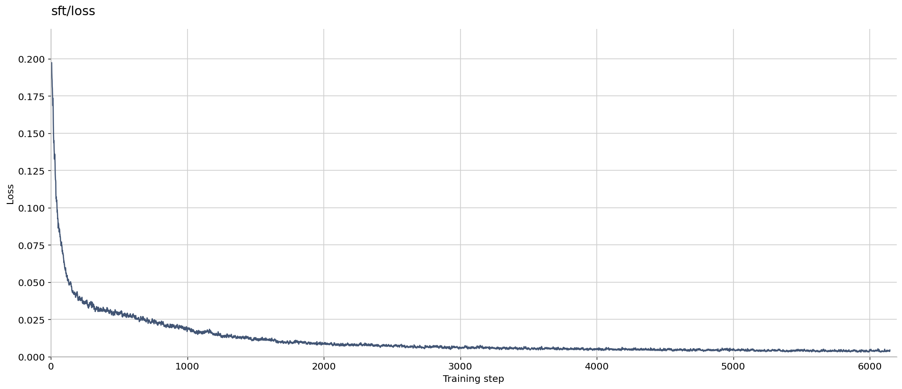

# Fine-tune PI0.5 on LIBERO Spatial

This guide shows how to fine-tune `Miical/pi05-base` on the
`lerobot/libero_spatial_image` dataset using supervised fine-tuning (SFT). The
launcher uses a repository-local `.venv` and is configured for a single node
with eight NVIDIA GPUs.

## Install the environment

The verified environment requires Python 3.10, an NVIDIA driver compatible
with PyTorch 2.7.1, and the following Ubuntu 22.04 packages:

```bash
sudo apt-get install build-essential cmake ffmpeg git \
  libgl1 libglib2.0-0 libosmesa6 python3.10-dev python3.10-venv
```

Then create the environment from the repository root:

```bash
python3.10 -m venv .venv
source .venv/bin/activate
python -m pip install --upgrade pip 'setuptools>=71,<81' wheel hf-transfer==0.1.9
python -m pip install --requirement requirements-lerobot.txt
python -m pip install --no-deps lerobot==0.4.4
python -m pip install --editable '.[pi0,libero]'
python scripts/install_libero_assets.py
python scripts/install_checks/check_libero.py
```

LeRobot is installed without dependency resolution because LeRobot 0.4.4
requires `rerun-sdk>=0.24`, whose Linux wheels require NumPy 2, while verl
0.7.1 requires NumPy 1. The preceding requirements file supplies the verified
runtime versions. Keep `.venv` activated when running the training and
evaluation launchers.

## Start training

```bash
bash examples/fine_tuning/pi05/run_train.sh
```

> **Optional: LoRA fine-tuning**
>
> To train only a LoRA adapter on the native PI0.5 policy, append the LoRA
> overrides to the same launcher:
>
> ```bash
> bash examples/fine_tuning/pi05/run_train.sh \
>   cluster.actor_rollout_ref.model.lora.rank=32 \
>   cluster.actor_rollout_ref.model.lora.alpha=32 \
>   cluster.actor_rollout_ref.model.lora.target_modules=all-linear
> ```
>
> The full verl checkpoint retains the adapter and optimizer state for resume.
> The `huggingface/` export contains only the merged native PI0.5 policy and
> remains loadable through the upstream policy implementation. A standard PEFT
> adapter is exported alongside it under `lora_adapter/` for adapter-only
> distribution or continued LoRA training.
>
> To initialize from an existing PEFT adapter directory, also set
> `cluster.actor_rollout_ref.model.lora.adapter_path` and keep `lora.rank` equal
> to the rank recorded by that adapter.

Models and datasets use the standard Hugging Face cache. Training artifacts
are written under `outputs/train/pi05-sft/libero-spatial`. The repository is
installed in editable mode, so Python changes are available without
reinstalling the environment.

On the first run, the launcher automatically:

1. downloads the LIBERO Spatial dataset through LeRobot;
2. computes the dataset normalization statistics;
3. downloads the PI0.5 checkpoint from Hugging Face; and
4. starts distributed SFT on all eight GPUs.

Downloaded files remain in the Hugging Face cache, while normalization
statistics and training outputs are reused from the training output directory.

## Default configuration

| Setting | Value |
| --- | --- |
| Model | `Miical/pi05-base` |
| Dataset | `lerobot/libero_spatial_image` |
| Nodes | 1 |
| GPUs | 8 |
| Global batch size | 256 |
| Micro-batch size | 16 |
| DataLoader workers | 8 |
| Action horizon | 10 |
| Epochs | 25 (approximately 5,150 steps) |
| Learning rate | `1e-4` |
| Weight decay | `1e-5` |
| Warmup ratio | `0.05` |
| Distributed strategy | FSDP2 |
| Model dtype | BF16 |
| Output | `outputs/train/pi05-sft/libero-spatial` |

## Monitor training

A running job reports loss and gradient metrics in the console:

```text
Training Progress: 1/5150 ... grad_pre=... sft_loss=...
```

Event files are written to:

```text
outputs/train/pi05-sft/libero-spatial/tensorboard
```

To view them, activate `.venv` in another terminal and start TensorBoard:

```bash
source .venv/bin/activate
tensorboard \
  --logdir outputs/train/pi05-sft/libero-spatial/tensorboard \
  --host 0.0.0.0 \
  --port 6006
```

Then open:

```text
http://localhost:6006
```

When training on a remote machine, replace `localhost` with the machine address
or forward port `6006` over SSH.

GPU utilization can be inspected from another terminal:

```bash
watch -n 1 nvidia-smi
```

The loss curve from a reference run is shown below:



## Evaluate the checkpoint

The evaluation launcher reads the latest saved checkpoint and runs the full
LIBERO Spatial benchmark:

```bash
bash examples/fine_tuning/pi05/run_eval.sh
```

The reference run evaluated all 10 tasks with 10 trials per task:

| Metric | Value |
| --- | ---: |
| Tasks | 10 |
| Trials per task | 10 |
| Successful trajectories | 100 / 100 |
| Success rate | 100% |
| Average return | 1.0 |
| Average successful trajectory length | 98.72 |
| Average successful trajectory chunk length | 10.34 |
| Total evaluation time | 51.69 seconds |

Every task achieved a 100% success rate. The
[complete evaluation metrics](../../_static/results/pi05-libero-spatial-eval.json)
include per-task trajectory lengths, counts, timing, and throughput.
