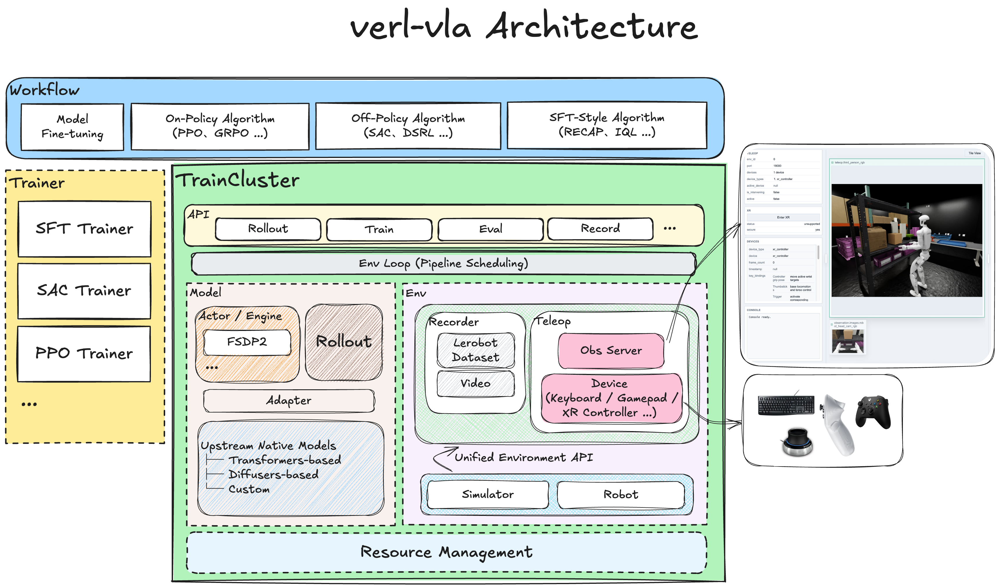

# Architecture

verl-vla organizes VLA post-training around a shared execution layer. A
workflow selects the training procedure, a trainer advances the algorithm, and
`TrainCluster` coordinates models, environments, and distributed resources.
The same components are reused across fine-tuning, reinforcement learning,
evaluation, and data collection.

## Workflows and trainers

The workflow layer defines the end-to-end procedure. It covers model
fine-tuning, on-policy algorithms such as PPO and GRPO, off-policy algorithms
such as SAC and DSRL, and SFT-style post-training algorithms such as RECAP and
IQL. A workflow composes the Hydra configuration, initializes the runtime, and
connects the selected trainer to a `TrainCluster`.

Trainers own algorithm progression. For example, the SFT, SAC, and PPO
trainers decide when to sample data, update parameters, evaluate the policy,
write checkpoints, and stop. They express these procedures through the
operations exposed by `TrainCluster` instead of managing distributed workers
or simulators directly.

For details on the entrypoint, workflow, and trainer boundaries and composing
reusable execution stages, see
[Workflows and Trainers](workflows-and-trainers.md).

## TrainCluster

`TrainCluster` is the central execution abstraction. It exposes a compact API
for operations such as:

- **Rollout**: run a policy in an environment and return trajectories.
- **Train**: execute distributed optimization on collected or offline data.
- **Eval**: evaluate a policy and aggregate metrics.
- **Record**: collect demonstrations, policy rollouts, or intervention data.

Below this API, the environment loop schedules model inference and environment
execution as a pipeline. `TrainCluster` owns worker placement, resource
allocation, lifecycle management, weight synchronization, and checkpoint
coordination, allowing trainers to remain independent of the distributed
topology.

For details on the four cluster topologies, worker and resource lifecycle,
training and interaction operations, recording and replay, model-state
synchronization, checkpointing, and diagnostics, see
[TrainCluster](train-cluster.md).

## Model integration

The model layer separates distributed execution from policy implementation:

- The **actor** implements the parameter update procedure required by a
  specific training algorithm, while the **training engine** provides the
  underlying distributed execution.
- The **rollout component** runs policy inference for environment interaction.
- The **adapter** integrates an upstream model with verl-vla and translates
  the framework's shared observation, action, and training contracts into the
  model's native interface.
- The **upstream native model** remains owned by its original implementation.

This separation allows workflows and trainers to use a common model interface
without depending on a particular policy backend. New policies can be
integrated through their adapters while retaining their native architecture
and checkpoint format.

For details on preserving an upstream policy, implementing the trainable model
base and canonical I/O adapter, declaring supported training capabilities,
adding model construction and Hydra configuration, and retaining native
checkpoint exports, see
[Model Integration](model-integration.md).

## Environment integration

The environment side presents one API over simulators and physical robots.
To integrate a new backend, you only need to implement the shared environment
lifecycle API, including operations such as `reset` and `step`, and translate
its native observations, actions, rewards, and episode signals into the common
contract. The environment can then be used directly by verl-vla's rollout,
recording, evaluation, and teleoperation workflows.

Recording and teleoperation are integrated at this boundary:

- The **recorder** writes LeRobot datasets and videos from environment
  transitions.
- The **teleoperation service** publishes observations to the browser and
  accepts input from keyboards, gamepads, XR controllers, and other devices.
- Human actions can override policy actions during intervention while the same
  environment loop continues to record the executed trajectory.

This shared path supports demonstrations, autonomous rollouts, evaluation, and
human-in-the-loop post-training without creating a separate environment
pipeline for each use case.

For details on implementing the `BaseEnv` lifecycle and data contracts, wiring
a backend into environment workers, defining its LeRobot recording schema, and
writing device-specific teleoperation and intervention policies, see
[Environment Integration](environment-integration.md).

## Resource and configuration ownership

Resource management spans model and environment workers so a workflow can
place training, rollout, and simulation roles on the available CPUs and GPUs.
Typed configuration remains next to the component that consumes it, while
composable Hydra configuration under `workflows/config/` defines the runtime
selected by users. This separation makes environments, models, and algorithms
independently replaceable while preserving one execution architecture.

For details on configuration ownership, cluster composition, CPU and GPU
worker sizing, colocated and separate actor/rollout deployment, Ray resource
labels and runtime environments, workflow overrides, and reusable Hydra
configuration components, see
[Resource and Configuration](resource-and-configuration.md).
