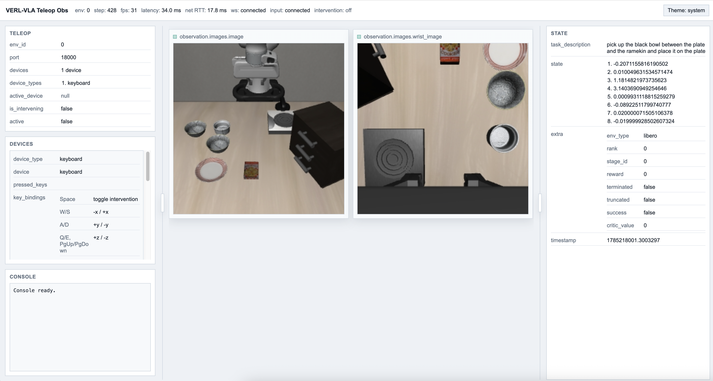

# Quick Start

This guide walks through an end-to-end workflow on a LIBERO task. You will
verify keyboard teleoperation, record and replay demonstrations, train an ACT
policy with supervised fine-tuning (SFT), evaluate it, and improve it further
with reinforcement learning. An optional DAgger workflow demonstrates how to
collect intervention-enhanced trajectories for a subsequent fine-tuning iteration.

## Prerequisites

Completing the full workflow requires **a CUDA-capable NVIDIA GPU**, such as an RTX
4090, for ACT fine-tuning. GPU acceleration is also recommended for LIBERO
rendering.

On systems without a GPU, the teleoperation and trajectory collection steps can
use OSMesa for CPU rendering, but simulation responsiveness may be reduced.

## Set up the environment

The following commands create a local Python environment on Ubuntu 22.04. Run
them from the repository root:

```bash
sudo apt-get update
sudo apt-get install -y \
  build-essential \
  cmake \
  ffmpeg \
  git \
  libgl1 \
  libglib2.0-0 \
  libosmesa6 \
  python3-dev \
  python3-venv

python3 -m venv .venv
source .venv/bin/activate
```

If PyPI access is slow from mainland China, configure the virtual environment
to use the Tsinghua mirror:

```bash
python -m pip config --site set \
  global.index-url https://pypi.tuna.tsinghua.edu.cn/simple
```

Then update the Python packaging tools and install the verified LeRobot runtime
and verl-vla LIBERO dependencies:

```bash
python -m pip install --upgrade pip setuptools wheel

python -m pip install --requirement requirements-lerobot.txt &&
python -m pip install --no-deps lerobot==0.4.4 &&
python -m pip install --editable ".[libero]"
```

The PyPI distribution of LIBERO does not include all simulator assets. Install
the revision verified by verl-vla, then verify the complete environment:

```bash
python scripts/install_libero_assets.py

python scripts/install_checks/check_libero.py
python -c "import av, torchcodec; from verl_vla.recorder import get_lerobot_dataset_cls; get_lerobot_dataset_cls()"
python -c "import torch; print(f'CUDA available: {torch.cuda.is_available()}')"
```

Activate the environment again with `source .venv/bin/activate` whenever you
open a new terminal.

## Test teleoperation

Use CUDA rendering when a GPU is available:

```bash
vvla-teleop \
  cluster.env.env_worker.simulator.libero.task_suite_name=libero_spatial \
  cluster.env.env_worker.simulator.libero.task_ids='[0]' \
  cluster.env.env_worker.teleop.devices='[keyboard]'
```

If no GPU is available for the environment, use this command instead:

```bash
vvla-teleop \
  cluster.env.env_worker.simulator.libero.task_suite_name=libero_spatial \
  cluster.env.env_worker.simulator.libero.task_ids='[0]' \
  cluster.env.env_worker.teleop.devices='[keyboard]' \
  cluster.resource.env.device=cpu \
  ray_kwargs.ray_init.runtime_env.env_vars.MUJOCO_GL=osmesa
```

Open `http://localhost:18000` in a browser to view the teleoperation dashboard.
If the simulator is running on a remote machine, replace `localhost` with the
machine's hostname or IP address.



Use the keyboard controls shown in the dashboard to operate the robot arm.
Press Enter at any time to reset the environment; it will also reset
automatically when the episode reaches its maximum length. Press Ctrl+C to stop
teleoperation.

## Record demonstrations

With GPU rendering:

```bash
vvla-record \
  num_episodes=10 \
  cluster.env.env_worker.simulator.libero.task_suite_name=libero_spatial \
  cluster.env.env_worker.simulator.libero.task_ids='[0]' \
  cluster.env.env_worker.teleop.devices='[keyboard]' \
  cluster.env.env_worker.recorder.lerobot.root="./outputs/record/lerobot" \
  cluster.env.env_worker.recorder.lerobot.repo_id=local/libero_spatial \
  cluster.env.env_worker.recorder.video.root="./outputs/record/videos" \
  resume=false
```

For CPU rendering:

```bash
vvla-record \
  num_episodes=10 \
  cluster.env.env_worker.simulator.libero.task_suite_name=libero_spatial \
  cluster.env.env_worker.simulator.libero.task_ids='[0]' \
  cluster.env.env_worker.teleop.devices='[keyboard]' \
  cluster.env.env_worker.recorder.lerobot.root="./outputs/record/lerobot" \
  cluster.env.env_worker.recorder.lerobot.repo_id=local/libero_spatial \
  cluster.env.env_worker.recorder.video.root="./outputs/record/videos" \
  cluster.resource.env.device=cpu \
  ray_kwargs.ray_init.runtime_env.env_vars.MUJOCO_GL=osmesa \
  resume=false
```

> **Tip:** For task 0, the demonstration can be completed using only W/A/S/D
> and Page Up/Page Down.

At the beginning of each episode, the console in the teleoperation dashboard
prompts you to confirm that recording should start. Press Enter to begin
recording.

When the task succeeds, the trajectory is saved automatically and the
environment resets for the next episode. Press Enter to save the current
episode early, or press Backspace to discard it and restart. The LeRobot
dataset is written to `./outputs/record/lerobot/local/libero_spatial`.

To upload the recorded dataset to Hugging Face, set a write token and run the
provided upload script:

```bash
export HF_TOKEN="hf_..."
python scripts/upload_lerobot_dataset.py \
  --root="./outputs/record/lerobot/local/libero_spatial" \
  --repo-id="YOUR_USERNAME/libero_spatial"
```

## Replay a recorded trajectory

```bash
vvla-replay \
  speed=1.0 \
  root="./outputs/record/lerobot/local/libero_spatial" \
  episode_indices='[0]'
```

Press Enter when prompted. Check that `executed_frames` matches
`expected_frames` in the replay result.

## Train ACT with SFT

The checked-in `assets/hf_models/act_libero` initializer contains no ACT policy
weights. It constructs a 10-step native ACT policy, loads the torchvision
ImageNet ResNet18 backbone, and randomly initializes the remaining parameters.

Run from the repository root:

```bash
vvla-train-sft \
  --config-dir "./examples/fine_tuning/act/self_collected_libero_spatial" \
  --config-name act_sft \
  cluster.actor_rollout_ref.model.path="./assets/hf_models/act_libero" \
  cluster.actor_rollout_ref.model.adapter.processor_dataset_root="./outputs/record/lerobot/local/libero_spatial" \
  data.repo_id=local/libero_spatial \
  data.root="./outputs/record/lerobot/local/libero_spatial" \
  data.batch_size=32 \
  cluster.resource.model.gpus_per_node=1 \
  cluster.actor_rollout_ref.actor.mini_batch_size=32 \
  cluster.actor_rollout_ref.actor.micro_batch_size=16 \
  cluster.actor_rollout_ref.actor.optim.lr=1e-4 \
  'trainer.logger=[console,tensorboard]' \
  trainer.total_epochs=100
```

Checkpoints and TensorBoard logs are written below
`./outputs/train/act-sft/libero-spatial/`.

While training runs, start TensorBoard in another terminal:

```bash
tensorboard \
  --logdir "./outputs/train/act-sft/libero-spatial/tensorboard" \
  --bind_all \
  --port 6006
```

Open `http://localhost:6006` to monitor the training metrics. When training on
a remote machine, expose or forward port 6006 first.

## Evaluate the trained policy

LIBERO task ids are zero-based, so `task_ids=[0]` selects task 1. Run the full
50-trial benchmark in parallel across 8 environments and two pipeline stages.
The command resolves the latest exported native ACT checkpoint:

```bash
vvla-eval \
  model/override@cluster.actor_rollout_ref.model.override_config=act \
  model/adapter@cluster.actor_rollout_ref.model.adapter=act \
  cluster.actor_rollout_ref.model.path="./outputs/train/act-sft/libero-spatial/checkpoints/global_step_$(cat "./outputs/train/act-sft/libero-spatial/checkpoints/latest_checkpointed_iteration.txt")/actor/huggingface" \
  cluster.actor_rollout_ref.model.load_tokenizer=false \
  cluster.env.env_worker.simulator.libero.task_suite_name=libero_spatial \
  cluster.env.env_worker.simulator.libero.task_ids='[0]' \
  cluster.resource.model.gpus_per_node=1 \
  cluster.resource.env.gpus_per_node=1 \
  cluster.env.env_worker.num_envs=8 \
  output_dir="./outputs/eval/act-sft/libero-spatial/task-1-parallel"
```

Metrics are written to
`./outputs/eval/act-sft/libero-spatial/task-1-parallel/metrics.json`, and videos
are written below the adjacent `videos/` directory.

## Collect intervention data with DAgger (Optional)

To collect 10 trajectories while watching and optionally intervening, run the
single-environment DAgger workflow with recording enabled:

```bash
vvla-dagger \
  model/override@cluster.actor_rollout_ref.model.override_config=act \
  model/adapter@cluster.actor_rollout_ref.model.adapter=act \
  cluster.actor_rollout_ref.model.path="./outputs/train/act-sft/libero-spatial/checkpoints/global_step_$(cat "./outputs/train/act-sft/libero-spatial/checkpoints/latest_checkpointed_iteration.txt")/actor/huggingface" \
  cluster.actor_rollout_ref.model.load_tokenizer=false \
  cluster.env.env_worker.simulator.libero.task_ids='[0]' \
  max_episodes=10
```

Open the `obs_url` printed by the command, focus the browser page, and press
Enter to start recording each trajectory. Press Space at any point to enter or
leave manual intervention. The 10 LeRobot episodes and videos are saved under
the DAgger defaults in `./outputs/dagger/`.

You can then fine-tune the policy again on the intervention-enhanced dataset.
This closes the data collection and policy improvement loop, completing the
DAgger post-training iteration.

## Improve the policy with TD3+BC

To make the effect of reinforcement learning directly observable, this guide
includes a compact RL example that starts from the SFT policy trained above and
further improves its task success rate. The example uses a TD3+BC-style actor
update and a fixed batch of newly collected experience:

In our reference experiment on LIBERO Spatial task 0, this workflow increased
the policy success rate from approximately 40% to approximately 80%.

- It adds action noise while collecting 64 initial trajectories to broaden the
  policy's exploration space and expose the critic to a wider range of
  successful and failed behavior. Evaluation remains deterministic and does
  not use this noise.
- It combines a Q-maximization objective with a behavior-cloning loss when
  updating ACT. This improves actions according to the learned value function
  while keeping the policy close to behavior represented in the replay data.
- It trains the critic for the first 200 steps, then freezes it while updating
  the policy. This deliberate choice keeps training stable and the workflow
  simple for this compact example.
- It performs no additional rollout collection after the initial batch, so the
  policy is improved through a reproducible single-batch training run.

The example uses one GPU for ACT training and one GPU for parallel LIBERO
environments. Start it from the repository root; the command loads the latest
SFT checkpoint produced above:

```bash
vvla-train-sac \
  --config-dir "./examples/rl/sac/act" \
  --config-name act_sac \
  cluster.actor_rollout_ref.model.path="./outputs/train/act-sft/libero-spatial/checkpoints/global_step_$(cat "./outputs/train/act-sft/libero-spatial/checkpoints/latest_checkpointed_iteration.txt")/actor/huggingface" \
  cluster.resource.model.gpus_per_node=1 \
  cluster.resource.env.gpus_per_node=1 \
  cluster.resource.env.workers_per_node=2 \
  cluster.env.env_worker.num_envs=8 \
  cluster.actor_rollout_ref.actor.mini_batch_size=64 \
  cluster.actor_rollout_ref.actor.micro_batch_size=8 \
  cluster.actor_rollout_ref.actor.optim.lr=5e-6 \
  'trainer.logger=[console,tensorboard]' \
  trainer.total_training_steps=400 \
  trainer.eval_episodes=50 \
  trainer.save_freq=50 \
  trainer.test_freq=50
```

Before updating the policy, the workflow runs a 50-episode evaluation to record
its starting success rate. It then evaluates every 50 training steps without
collection noise. Checkpoints, TensorBoard logs, evaluation videos, and replay
data are written under
`./outputs/rl/sac/act/self-collected-libero-spatial-single-batch/`.

Monitor the success-rate curve in another terminal:

```bash
tensorboard \
  --logdir "./outputs/rl/sac/act/self-collected-libero-spatial-single-batch/tensorboard" \
  --bind_all \
  --port 6007
```

Open `http://localhost:6007` and compare `val/trajectory_success_rate` with the
initial evaluation. Select the checkpoint with the highest validation success
rate rather than assuming that the final checkpoint is the best one. You have
now completed the full path from demonstration collection and supervised
fine-tuning to reinforcement learning post-training.

## Next steps

Congratulations—you have completed an end-to-end VLA post-training workflow,
from collecting demonstrations and supervised fine-tuning to policy evaluation
and reinforcement learning. From this point on, every model post-training
workflow follows this same process; only the environment, model, and
reinforcement learning algorithm change to suit the task.

- You may work with a different simulator or a physical robot. To set up these
  environments and collect data with their supported control devices, see
  [Data Collection](../data-collection/index.md).
- You may fine-tune a different VLA model. For model-specific datasets,
  configurations, and complete training recipes, see
  [Fine-Tuning](../fine-tuning/index.md).
- You may use additional reinforcement learning algorithms to improve your
  policy. For the supported algorithms and runnable training examples, see
  [Reinforcement Learning](../reinforcement-learning/index.md).

For a deeper understanding of how verl-vla connects and composes these stages,
continue with the [Framework Overview](../framework-overview/index.md).
