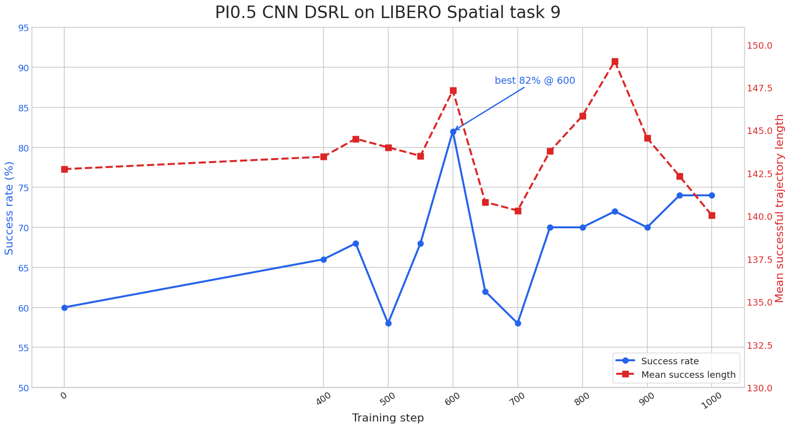
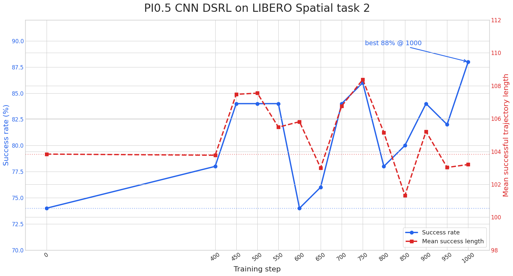

# PI0.5 DSRL on LIBERO Spatial

This guide records reproducible DSRL online RL recipes on LIBERO Spatial. It
includes experiments on tasks 9 and 2. Both start
from the deliberately undertrained
[`Miical/pi05-libero-spatial-sft-step-100`](https://huggingface.co/Miical/pi05-libero-spatial-sft-step-100)
checkpoint. In both experiments the native PI0.5 policy is frozen; only the
newly initialized DSRL actor and critic are optimized.

Both trainable networks use independent CNN observation encoders. This matches
the observation path used by the original DSRL implementation and avoids a
frozen PI0.5 backbone forward during each update. PI0.5 is still used to produce
the base action chunk during environment interaction, and the DSRL actor learns
the steering residual applied to that chunk.

## Install the environment

Complete the
[PI0.5 LIBERO Spatial environment setup](../../../fine-tuning/pi05/libero-spatial.md)
before starting this recipe. The experiment uses the same `.venv`, PI0.5
dependencies, LIBERO assets, and OSMesa rendering setup.

The tested topology uses eight model GPUs and 16 CPU environment workers with
two environments per worker, for 32 parallel auto-reset environments.

## Start training

### Task 9 reference run

Run the launcher from the repository root:

```bash
bash examples/rl/dsrl/pi05/libero_spatial_online_from_sft_step100/run_train_task9.sh
```

LIBERO task IDs are zero-based, so `task_ids: [9]` selects the tenth Spatial
task. Use an empty `output_dir` for every fresh run because SAC restores replay
shards found in an existing output directory independently of model-checkpoint
resume.

### Task 2 run

The task-2 recipe uses the same CNN actor and critic. For this task, the rollout
noise scale was increased from `0.02` to `0.5` to provide more exploration.
Its stable parameters are recorded in its launcher:

```bash
bash examples/rl/dsrl/pi05/libero_spatial_online_from_sft_step100/run_train_task2.sh
```

This launcher shares `dsrl.yaml` with the task-9 launcher and supplies
the SFT step-100 model, eight-GPU topology, 16 CPU workers with two environments
each, batch sizes, renderer, output directory, and TensorBoard directory. The
two launchers provide their task ID and rollout noise scale. The shared YAML
owns the CNN actor and critic, SAC/CQL parameters, replay ratios, rollout
cadence, and evaluation cadence.

## Experiment configuration

The two launchers differ only in the task and rollout noise scale:

| Launcher | LIBERO task ID | DSRL `rollout_noise_scale` |
| --- | ---: | ---: |
| Task 9 | `9` | `0.02` |
| Task 2 | `2` | `0.5` |

All remaining settings are shared through `dsrl.yaml`:

| Setting | Value |
| --- | --- |
| Starting policy | PI0.5 SFT step 100 |
| Native PI0.5 policy | Frozen |
| Action chunk size | 10 |
| DSRL actor | CNN encoder and residual-noise MLP |
| Critic | CNN encoder, 10 heads |
| CNN image size | 64 |
| CNN channels | `[32, 32, 32, 32]` |
| CNN strides | `[2, 1, 1, 1]` |
| CNN latent dimension | 50 |
| CNN MLP hidden dimensions | `[128, 128, 128]` |
| Training steps | 1,000 |
| Global / micro batch size | 128 / 16 |
| Actor learning rate | `5e-6` |
| Critic learning rate | `1e-4` |
| Critic warmup | 400 steps |
| Actor update interval | Every 2 steps after warmup |
| Actor objective | SAC actor objective |
| Entropy tuning | Disabled, `alpha=0.0` |
| TD3+BC actor loss | Disabled |
| Critic objective | TD loss + CQL |
| CQL weight / action noise | `0.5` / `1.0` |
| Critic replay sampling | 50% positive, 50% negative |
| Actor replay sampling | 90% positive, 10% negative |
| Per-step steering noise | Enabled |
| Initial online collection | One rollout at step 1 |
| Later online collection | One rollout every 50 steps after warmup |
| Environment parallelism | 16 CPU workers x 2 environments |
| Evaluation | 50 deterministic trajectories every 50 steps after warmup |

The first online rollout supplies the replay data used during critic warmup.
Actor updates begin at step 400, while critic training continues on the
non-actor update steps. Online rollouts include DSRL exploration noise;
evaluation rollouts are deterministic.

## Outputs and monitoring

Artifacts are written below the selected output directory:

```text
<output_dir>/
|-- checkpoints/
|-- replay/
|-- tensorboard/
`-- videos/
```

Start TensorBoard in another terminal:

```bash
source .venv/bin/activate
tensorboard \
  --logdir outputs/rl/dsrl/pi05/libero-spatial-task9-cnn/tensorboard \
  --bind_all \
  --port 6007
```

Use `val/trajectory_success_rate` to select a checkpoint. The validation curve
is not monotonic, so the final checkpoint should not automatically replace the
best observed checkpoint.

## Task 9 result

The recorded run is stored at:

```text
outputs/rl/dsrl/pi05/libero-spatial-task9-cnn-actor-critic-repro-local_20260812_112700
```

The initial policy succeeded on 30 of 50 deterministic trajectories. The best
checkpoint, step 600, succeeded on 41 of 50 trajectories, improving success
from 60% to 82%. The final step-1000 checkpoint reached 74%.

| Step | Successful trajectories | Success rate | Mean successful trajectory length |
| ---: | ---: | ---: | ---: |
| 0 | 30 / 50 | 60% | 142.73 |
| 400 | 33 / 50 | 66% | 143.45 |
| 450 | 34 / 50 | 68% | 144.50 |
| 500 | 29 / 50 | 58% | 144.00 |
| 550 | 34 / 50 | 68% | 143.50 |
| 600 | 41 / 50 | 82% | 147.32 |
| 650 | 31 / 50 | 62% | 140.81 |
| 700 | 29 / 50 | 58% | 140.31 |
| 750 | 35 / 50 | 70% | 143.77 |
| 800 | 35 / 50 | 70% | 145.83 |
| 850 | 36 / 50 | 72% | 149.03 |
| 900 | 35 / 50 | 70% | 144.54 |
| 950 | 37 / 50 | 74% | 142.32 |
| 1000 | 37 / 50 | 74% | 140.03 |



The result demonstrates a clear improvement over the starting checkpoint, but
also substantial checkpoint-to-checkpoint variance. Step 600 is the checkpoint
to retain for this run. The trajectory-length metric did not improve alongside
peak success, so the observed gain is primarily a higher completion rate rather
than faster completion.

CNN actor and critic updates took approximately 0.08-0.15 seconds per ordinary
training step. Most wall time therefore came from online environment collection
and the 50-trajectory deterministic evaluations rather than neural-network
optimization.

## Task 2 result

The task-2 run is stored at:

```text
outputs/rl/dsrl/pi05/libero-spatial-task2-cnn-noise050-repro-local_20260813_113425
```

The initial deterministic evaluation of the SFT step-100 policy succeeded on
37 of 50 trajectories. The final step-1000 checkpoint succeeded on 44 of 50,
improving success from 74% to 88%. The final checkpoint is also the best
checkpoint observed during this run.

| Step | Successful trajectories | Success rate | Mean successful trajectory length |
| ---: | ---: | ---: | ---: |
| 0 | 37 / 50 | 74% | 103.84 |
| 400 | 39 / 50 | 78% | 103.77 |
| 450 | 42 / 50 | 84% | 107.48 |
| 500 | 42 / 50 | 84% | 107.55 |
| 550 | 42 / 50 | 84% | 105.48 |
| 600 | 37 / 50 | 74% | 105.81 |
| 650 | 38 / 50 | 76% | 103.00 |
| 700 | 42 / 50 | 84% | 106.76 |
| 750 | 43 / 50 | 86% | 108.37 |
| 800 | 39 / 50 | 78% | 105.15 |
| 850 | 40 / 50 | 80% | 101.32 |
| 900 | 42 / 50 | 84% | 105.21 |
| 950 | 41 / 50 | 82% | 103.02 |
| 1000 | 44 / 50 | 88% | 103.20 |



The final success rate is 14 percentage points above the initial policy. Mean
successful trajectory length changed from 103.84 to 103.20 steps, so the gain
did not come from allowing longer successful episodes. The validation curve is
still noisy, including a return to 74% at step 600, but it recovered and ended
at a new maximum. The full 1,000-step run, including online collection,
checkpointing, and 50-trajectory evaluations, took approximately 1 hour and 25
minutes.
