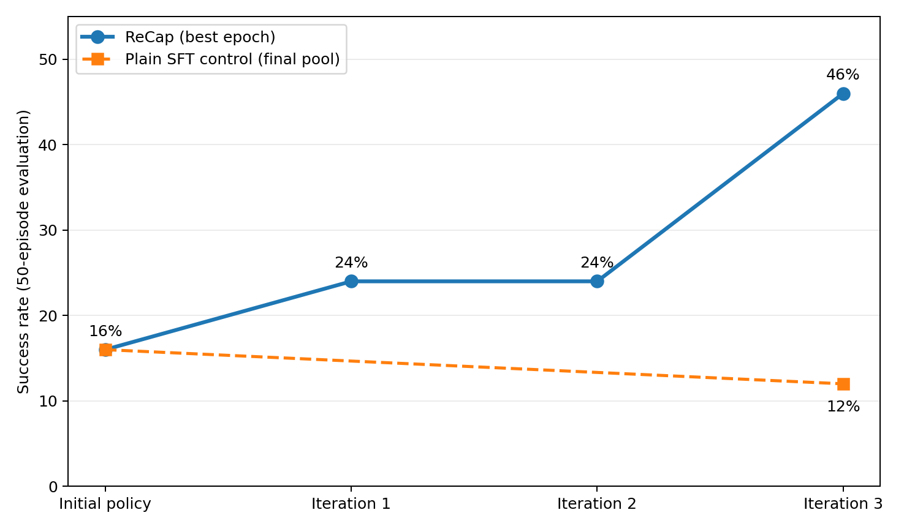
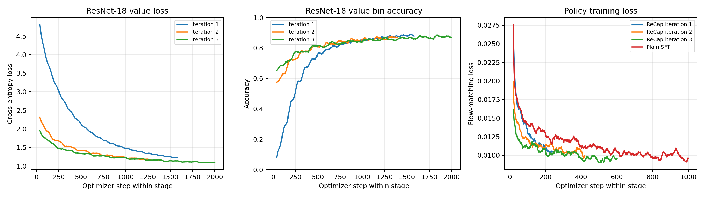

# PI0.5 RECAP on LIBERO-10 Task 8 from 10 Demonstrations

This guide reproduces the three-iteration RECAP experiment on LIBERO-10 task
8: “put both moka pots on the stove.” It starts from
[`Miical/pi05-libero10-task8-sft-10demos`](https://huggingface.co/Miical/pi05-libero10-task8-sft-10demos),
an intentionally weak PI0.5 policy fine-tuned on only 10 demonstrations. The
initial policy succeeds on 8 of 50 trajectories (16%).

The best policy after three RECAP iterations succeeds on 23 of 50
trajectories (46%). A plain-SFT control trained on the same final 106-episode
pool peaks at 6 of 50 (12%), indicating that adding rollout data without the
RECAP labels does not explain the gain.

## Install the environment

Complete the
[PI0.5 LIBERO environment setup](../../../fine-tuning/pi05/libero-spatial.md)
before starting this recipe. RECAP uses the same repository-local `.venv`,
PI0.5 dependencies, LIBERO assets, and standard Hugging Face cache; no
additional Python packages are required.

The reference topology uses eight CUDA-capable GPUs for PI0.5, two GPUs for
the ResNet-18 value model, and eight CPU workers hosting 16 parallel LIBERO
environments through OSMesa. Keep `.venv` activated for dataset preparation,
training, and TensorBoard.

## Prepare the initial dataset

Create a fresh run root and download the published 10-demonstration dataset.
These are the official demonstrations used to train the initial policy.

```bash
RUN_ROOT=outputs/rl/recap/pi05/libero10-task8-from-sft-10demos
DATASET_ROOT="$RUN_ROOT/datasets/local/pi05_libero10_task8_recap"

hf download Miical/pi05-libero10-task8-10demos \
  --repo-type dataset \
  --local-dir "$DATASET_ROOT"
```

The downloaded dataset is already in the verl-vla recorder schema. All 4,033
demonstration frames have `info.is_intervention=true`; no conversion or manual
annotation is required. The initial dataset intentionally has no `recap.*`
columns—the workflow adds them automatically during return computation.

Use an empty `RUN_ROOT` when starting from scratch. RECAP appends each new
32-trajectory rollout round to this local LeRobot dataset.

The published initial checkpoint was trained from `Miical/pi05-base` using
only those 10 trajectories:

| Setting | Value |
| --- | --- |
| Training data | 10 trajectories, 4,033 frames |
| Training | 20 epochs, 300 optimizer steps |
| Model GPUs | 8 |
| Global / micro batch size | 256 / 16 |
| Learning rate | `1e-4` |
| Weight decay | `1e-5` |
| Warmup ratio | 5% |
| Evaluation | 8 / 50 successful trajectories (16%) |

## Start training

Run the maintained launcher from the repository root:

```bash
bash examples/rl/recap/pi05/libero10_task8_from_sft_10demos/run_train.sh
```

The launcher selects
`examples/rl/recap/pi05/libero10_task8_from_sft_10demos/libero10_task8.yaml`,
which composes the shared six-stage RECAP workflow. The YAML owns the task,
iteration count, rollout and evaluation sizes, return and label settings,
training schedules, and relationships between output paths. The launcher
supplies machine-specific model and output locations, GPU and environment
resources, batch sizes, headless rendering, and the TensorBoard directory.

The workflow starts a local Ray runtime; no separate `ray start` command is
required. Append Hydra overrides to adapt the machine topology. For example,
run value-model inference on one GPU with:

```bash
bash examples/rl/recap/pi05/libero10_task8_from_sft_10demos/run_train.sh \
  recap.value_infer.num_gpus=1
```

Each iteration evaluates the incoming policy, collects 32 trajectories,
updates the cumulative dataset, trains and applies the value model, and then
fine-tunes PI0.5. The workflow also evaluates the policy produced by the final
iteration, yielding four complete evaluations: initial, iteration 1,
iteration 2, and iteration 3.

The 32 trajectories collected in each iteration are autonomous policy
rollouts. We did not use DAgger or any other human intervention during this
collection. Human demonstrations are limited to the initial 10-trajectory
dataset prepared above.

## Outputs and monitoring

All run artifacts are derived from one output root:

```text
outputs/rl/recap/pi05/libero10-task8-from-sft-10demos/
├── checkpoints/
│   ├── policy/
│   └── value_model/
├── datasets/
│   └── local/
│       └── pi05_libero10_task8_recap/
├── eval_results/
├── tensorboard/
└── videos/
    ├── eval/
    └── rollout/
```

Start TensorBoard in another terminal:

```bash
source .venv/bin/activate
tensorboard \
  --logdir outputs/rl/recap/pi05/libero10-task8-from-sft-10demos/tensorboard \
  --bind_all \
  --port 6008
```

Open `http://localhost:6008`, or forward port 6008 when training remotely.
Evaluation JSON files under `eval_results/` and videos under `videos/eval/`
are the authoritative policy-selection evidence; training loss alone does not
predict the best checkpoint.

## Reference configuration

| Setting | Value |
| --- | --- |
| Task | LIBERO-10 task 8 |
| Starting policy | PI0.5 SFT on 10 demonstrations |
| RECAP iterations | 3 |
| Evaluation | 50 evaluation trajectories before each round and after the final round |
| Collection | 32 trajectories per iteration |
| Collection intervention | None; autonomous rollouts without DAgger |
| Maximum episode length | 520 environment steps |
| Environment parallelism | 8 CPU workers, 2 environments each |
| Value model | Official ImageNet-pretrained ResNet-18, fully trainable |
| Value-model training | 10 epochs per iteration |
| Value-model GPUs | 2 |
| Value global / micro batch size | 256 / 32 |
| Advantage horizon / smoothing window | 50 / 50 frames |
| Advantage smoothing decay | `0.95` |
| Target positive ratio | 5% before forced-positive demonstrations |
| Policy training | 3 epochs per iteration |
| Policy GPUs | 8 |
| Policy global / micro batch size | 256 / 16 |
| Policy learning rate | `1e-4` |

The ResNet-18 value model encodes the agent and wrist cameras independently,
then fuses both visual features with the eight-dimensional robot state. Value
model and policy training each use one checkpoint directory across RECAP
iterations. Their `resume_mode: auto` setting restores the latest checkpoint
in that directory when the next training stage starts.

Returns are normalized to `[-1, 0]`. Value inference ranks exponentially
smoothed 50-step advantages within the task. Because the rollout rounds contain
relatively few successful trajectories, we set the target positive ratio to
5% to provide a broader positive training signal. Every frame from the initial
10-demonstration dataset is also forced positive, regardless of its inferred
advantage. The measured positive-frame fraction can therefore exceed 5%.

## Evaluation results

We observed substantial, non-monotonic success-rate variation while retraining
the policy within each RECAP iteration. The results below therefore report a
better-performing, fully evaluated checkpoint selected from each iteration,
rather than assuming that the last checkpoint is always the best one. Further
experiments are needed to understand the source of this variation and make
policy improvement more stable.

The reference experiment was stopped and resumed several times while these
checkpoints were evaluated and selected. The checked-in launcher captures the
final workflow and configuration, but a single uninterrupted run may not
reproduce the exact success rates reported here. Treat the published results
as a verified reference run rather than a guarantee for every execution.

| Policy | Policy epoch | Successful trajectories | Success rate | Mean successful trajectory length |
| --- | ---: | ---: | ---: | ---: |
| Initial policy | — | 8 / 50 | 16% | 389.25 |
| RECAP iteration 1 | 1 | 5 / 50 | 10% | 438.00 |
| RECAP iteration 1 | 3 | 12 / 50 | 24% | 413.33 |
| RECAP iteration 2 | 1 | 4 / 50 | 8% | 415.00 |
| RECAP iteration 2 | 2 | 12 / 50 | 24% | 392.00 |
| RECAP iteration 2 | 3 | 1 / 50 | 2% | 410.00 |
| RECAP iteration 3 | 1 | 7 / 50 | 14% | 422.43 |
| RECAP iteration 3 | 2 | 10 / 50 | 20% | 407.80 |
| RECAP iteration 3 | 3 | 23 / 50 | 46% | 397.04 |



The dashed plain-SFT line connects the common initial policy to the measured
final-pool control. It does not represent unmeasured intermediate SFT rounds.

## Plain-SFT control

The control starts from the same 10-demonstration checkpoint and trains on the
same final cumulative dataset, but disables advantage-conditioned prompting
and ignores `recap.indicator`.

| Plain-SFT epoch | Successful trajectories | Success rate | Mean successful trajectory length |
| ---: | ---: | ---: | ---: |
| 1 | 2 / 50 | 4% | 462.00 |
| 3 | 6 / 50 | 12% | 399.17 |
| 5 | 4 / 50 | 8% | 406.75 |

In this experiment, separating frames through inferred advantage labels is
the key difference between the policy updates.

## Training curves

The value-model curves concatenate the optimizer steps from the three value
training stages. The policy panel shows PI0.5's native flow-matching loss for
the three RECAP stages and the plain-SFT control. Curves are smoothed only for
readability; checkpoint selection uses unsmoothed environment evaluation.



## Published artifacts

| Artifact | Location |
| --- | --- |
| Initial 10-demonstration policy | [`Miical/pi05-libero10-task8-sft-10demos`](https://huggingface.co/Miical/pi05-libero10-task8-sft-10demos) |
| Initial 10-demonstration dataset | [`Miical/pi05-libero10-task8-10demos`](https://huggingface.co/datasets/Miical/pi05-libero10-task8-10demos) |
| Final cumulative labeled dataset | [`Miical/pi05-libero10-task8-recap`](https://huggingface.co/datasets/Miical/pi05-libero10-task8-recap) |
| Interactive episode viewer | [Open in the LeRobot visualizer](https://huggingface.co/spaces/lerobot/visualize_dataset?path=Miical%2Fpi05-libero10-task8-recap) |

The final dataset uses LeRobot's native Hub format and contains 106 episodes:

| Episode range | Source | Episodes | Successful episodes |
| ---: | --- | ---: | ---: |
| 0–9 | Initial official demonstrations | 10 | 10 |
| 10–41 | RECAP iteration 1 rollout | 32 | 3 |
| 42–73 | RECAP iteration 2 rollout | 32 | 8 |
| 74–105 | RECAP iteration 3 rollout | 32 | 9 |

Open the visualizer and select an episode index to inspect its camera streams,
actions, returns, inferred values, advantages, and binary indicator. The
published indicators were recomputed over the complete final pool by the
iteration-3 value model; they are not frozen historical labels from the round
in which each episode was collected.
