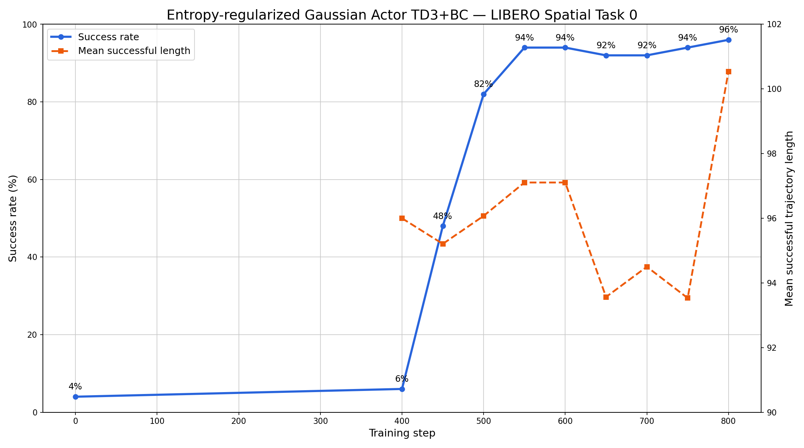
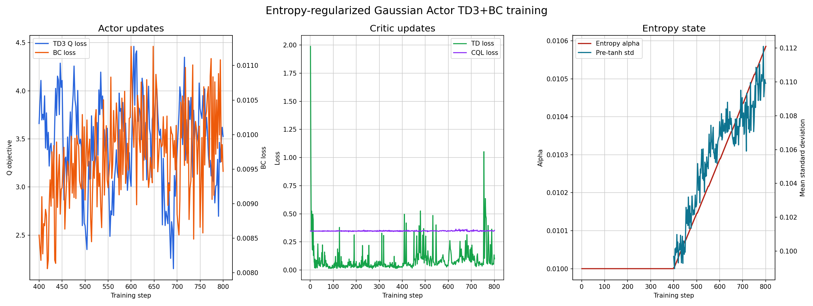

# Gaussian Actor TD3+BC on LIBERO Spatial Task 0

This guide records the online entropy-regularized TD3+BC experiment on LIBERO
Spatial task 0:
“pick up the black bowl between the plate and the ramekin and place it on the
plate.” It improves the exact
[`Miical/gaussian-actor-libero-spatial-task0-step100-baseline`](https://huggingface.co/Miical/gaussian-actor-libero-spatial-task0-step100-baseline)
policy from 2/50 successes (4%) to 48/50 (96%) at step 800. The five evaluations
from step 600 through step 800 remain between 92% and 96%.

The run uses online replay only: RLPD and offline replay are disabled. Training
rollouts sample the corrected tanh-Gaussian policy at standard-deviation scale
`0.1`; evaluation uses its deterministic mean. No additional action noise is
applied.

## Install the environment

Complete the [Quick Start environment setup](../../../getting-started/index.md)
before starting this recipe. The reference topology uses three CUDA-capable
NVIDIA GPUs: one for the model and two for EGL-rendered environment workers.
Each environment worker owns eight environments and the environment loop has
two pipeline stages, giving 32 simulator instances in total.

## Start training

Run the launcher from the repository root:

```bash
bash examples/rl/td3_bc/gaussian_actor/libero_spatial_task0_online_from_hf_step100/run_train.sh
```

The launcher selects
`examples/rl/td3_bc/gaussian_actor/libero_spatial_task0_online_from_hf_step100/td3_bc.yaml`.
The YAML owns the algorithm, adapter, task, rollout schedule, and output-path
relationships. The launcher supplies the model, machine topology, output root,
and MuJoCo rendering backend.

The reported run started from an empty replay directory. Its first three warm
rollouts produced 5/32, 9/32, and 9/32 successful trajectories. The first
rollout filled replay with 529 positive and 1,000 negative transitions; the
second filled both configured class capacities of 1,000 transitions. This is
online policy data, not expert demonstrations or RLPD data.

## Outputs and monitoring

All artifacts are derived from the default run root:

```text
outputs/rl/td3-bc/gaussian-actor/libero-spatial-task0-online-from-hf-step100/
├── checkpoints/
├── replay/
├── tensorboard/
└── videos/
```

Training rollouts and every 50-trajectory evaluation write videos under
`videos/`. Start TensorBoard in another terminal:

```bash
source .venv/bin/activate
tensorboard \
  --logdir outputs/rl/td3-bc/gaussian-actor/libero-spatial-task0-online-from-hf-step100/tensorboard \
  --bind_all \
  --port 6007
```

## Reference configuration

| Setting | Value |
| --- | --- |
| Starting policy | Gaussian Actor HF step 100 |
| Training steps | 800 |
| Model GPUs | 1 |
| Environment workers | 2 GPU workers, 8 environments each, 2 pipeline stages |
| Global / micro batch size | 128 / 128 |
| Actor learning rate | `5e-6`, constant |
| Critic learning rate | `1e-4`, constant |
| Critic hidden dimensions | `[512, 256, 128]` |
| Discount / target update | `0.99` / hard update (`tau=1.0`) |
| Critic warmup | 400 steps |
| Actor update interval | Every 2 steps after warmup |
| Actor objective | TD3+BC, BC weight `0.5` |
| Actor replay sampling | 90% positive, 10% negative |
| Critic objective | TD loss + CQL, CQL weight `0.5` |
| Critic replay sampling | 50% positive, 50% negative |
| Configured online replay capacity | 1,000 transitions per class and task |
| Offline replay / RLPD | Disabled (`offline_sample_batch_size=0`) |
| Initial online collection | One 32-trajectory rollout on each of the first 3 steps |
| Later online collection | Two 32-trajectory rollouts every 50 steps after warmup |
| Gaussian rollout sampling | Corrected diagonal std, scale `0.1` |
| Additional actor / evaluation noise | `0.0` / `0.0` |
| Automatic entropy tuning | Enabled; initial alpha `0.01`, target entropy `-3.5` |
| Episode / interaction limit | 256 / 256 steps |
| Evaluation | 50 fixed, zero-noise trajectories per checkpoint |

The critic is updated during warmup. After step 400, actor and critic updates
alternate; the critic update is skipped on actor-update steps. The target
critic is hard-synchronized during warmup and the target action is resampled
for critic updates.

## Evaluation results

| Step | Successful trajectories | Success rate | Mean successful trajectory length |
| ---: | ---: | ---: | ---: |
| 0 | 2 / 50 | 4% | — |
| 400 | 3 / 50 | 6% | 96.00 |
| 450 | 24 / 50 | 48% | 95.21 |
| 500 | 41 / 50 | 82% | 96.07 |
| 550 | 47 / 50 | 94% | 97.11 |
| 600 | 47 / 50 | 94% | 97.11 |
| 650 | 46 / 50 | 92% | 93.57 |
| 700 | 46 / 50 | 92% | 94.50 |
| 750 | 47 / 50 | 94% | 93.53 |
| 800 | 48 / 50 | **96%** | 100.54 |



The result is not inferred from training rollout counts. Each table row after
step 0 comes from a separate fixed 50-trajectory evaluation, and the saved
videos agree with the success/failure counts. Mean trajectory length includes
successful trajectories only.

## Training losses



Actor losses begin when critic warmup ends at step 400. The critic's TD loss
remains near or below its CQL term through the useful part of training. Automatic
entropy tuning raises alpha from `0.010000` to `0.010585`; the mean pre-tanh
standard deviation moves from `0.09969` at the first actor update to `0.10992`
at step 800. The deterministic evaluation nevertheless remains stable at
92–96% from step 550 onward.
