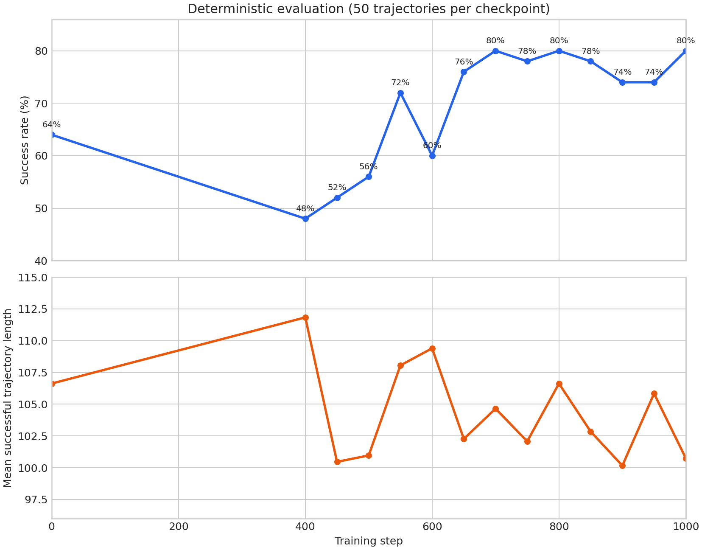
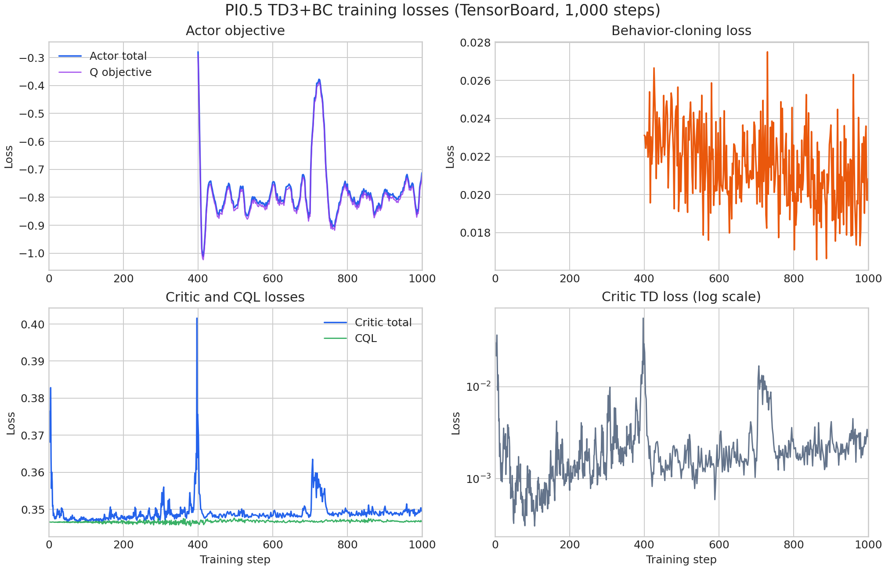

# PI0.5 TD3+BC on LIBERO Spatial Task 2

This guide reproduces the reference online TD3+BC experiment on LIBERO Spatial
task 2: “pick up the black bowl from table center and place it on the plate.”
It updates the PI0.5 policy itself and does not enable the DSRL noise actor.

The run starts from the deliberately undertrained
[`Miical/pi05-libero-spatial-sft-step-100`](https://huggingface.co/Miical/pi05-libero-spatial-sft-step-100)
checkpoint. That policy was trained for 100 SFT steps, approximately 0.49
epochs of the official LIBERO Spatial dataset, leaving room to measure the
effect of reinforcement learning.

## Install the environment

Complete the
[PI0.5 LIBERO Spatial environment setup](../../../fine-tuning/pi05/libero-spatial.md)
before starting this recipe. RL uses the same repository-local `.venv`, PI0.5
dependencies, and LIBERO assets; no additional Python packages are required.

The reference topology uses eight CUDA-capable GPUs for PI0.5 and four CPU
workers running 32 parallel LIBERO environments through OSMesa. Keep `.venv`
activated for training and TensorBoard. The starting model is public and is
downloaded through the standard Hugging Face cache on the first run.

## Start training

Run the launcher from the repository root:

```bash
bash examples/rl/td3_bc/pi05/libero_spatial_task2_online_from_sft_step100/run_train.sh
```

The launcher selects
`examples/rl/td3_bc/pi05/libero_spatial_task2_online_from_sft_step100/td3_bc.yaml`,
which composes the shared SAC workflow and the PI0 adapter. The YAML owns the
algorithm, model adapter, task, rollout schedule, and relationships between
output paths. The launcher supplies machine-specific values: model and output
locations, GPU and environment resources, batch sizes, and MuJoCo rendering.

The workflow starts a local Ray runtime; no separate `ray start` command is
required. Append Hydra overrides to change the machine topology or experiment
configuration. For example, use a new run root without changing any other
paths:

```bash
bash examples/rl/td3_bc/pi05/libero_spatial_task2_online_from_sft_step100/run_train.sh \
  output_dir=./outputs/rl/td3-bc/pi05/my-task-2-run \
  ray_kwargs.ray_init.runtime_env.env_vars.TENSORBOARD_DIR=./outputs/rl/td3-bc/pi05/my-task-2-run/tensorboard
```

Always use an empty `output_dir` for a run from scratch. SAC restores replay
shards when they already exist, independently of model-checkpoint resume.

## Outputs and monitoring

All artifacts are derived from the default run root:

```text
outputs/rl/td3-bc/pi05/libero-spatial-task2-online-from-sft-step100/
├── checkpoints/
├── replay/
├── tensorboard/
└── videos/
```

The initial evaluation and every evaluation after critic warmup use 50
deterministic trajectories. Evaluation and rollout videos are written under
`videos/`; exploration noise is disabled during evaluation.

Start TensorBoard in another terminal:

```bash
source .venv/bin/activate
tensorboard \
  --logdir outputs/rl/td3-bc/pi05/libero-spatial-task2-online-from-sft-step100/tensorboard \
  --bind_all \
  --port 6007
```

Open `http://localhost:6007`, or forward port 6007 when training on a remote
machine. Compare `val/trajectory_success_rate` across checkpoints rather than
assuming that success increases monotonically.

## Reference configuration

| Setting | Value |
| --- | --- |
| Starting policy | PI0.5 SFT step 100 |
| Training steps | 1,000 |
| Model GPUs | 8 |
| Environment workers | 4 CPU workers, 8 environments each |
| Global / micro batch size | 128 / 16 |
| Actor learning rate | `5e-6` |
| Critic learning rate | `1e-4` |
| Critic warmup | 400 steps |
| Actor update interval | Every 2 steps after warmup |
| Actor objective | TD3+BC, BC weight `0.5` |
| Actor replay sampling | 90% positive, 10% negative |
| Critic objective | TD loss + CQL, CQL weight `0.5` |
| Critic replay sampling | 50% positive, 50% negative |
| Environment parallelism | 32 auto-reset environments |
| Initial online collection | One rollout on each of the first 3 steps |
| Later online collection | One rollout every 50 steps after warmup |
| Exploration | Noise level `0.02` |
| Automatic entropy tuning | Disabled |
| Evaluation | 50 deterministic trajectories per checkpoint |

LIBERO task IDs are zero-based, so `task_ids: [2]` selects the third Spatial
task. The first 400 steps warm up the critic without actor updates. Fresh
collection is suppressed during the rest of that warmup after the three
initial rollout steps. The run then updates the actor every other trainer step
and collects a new online rollout every 50 steps. Each rollout advances the 32
environments for up to 20 action chunks and stores every episode completed by
auto-reset, so the number of collected trajectories is not fixed. The launch
smoke test collected 69 trajectories on its first training rollout.

## Evaluation results

The initial policy succeeded on 32 of 50 trajectories. The final checkpoint
succeeded on 40 of 50, increasing the measured success rate from 64% to 80%.
The run first reached 80% at step 700 and matched it again at steps 800 and
1,000. Performance fluctuated between evaluations rather than increasing
monotonically.

| Step | Successful trajectories | Success rate | Mean successful trajectory length |
| ---: | ---: | ---: | ---: |
| 0 | 32 / 50 | 64% | 106.63 |
| 400 | 24 / 50 | 48% | 111.83 |
| 450 | 26 / 50 | 52% | 100.46 |
| 500 | 28 / 50 | 56% | 100.96 |
| 550 | 36 / 50 | 72% | 108.06 |
| 600 | 30 / 50 | 60% | 109.40 |
| 650 | 38 / 50 | 76% | 102.26 |
| 700 | 40 / 50 | 80% | 104.65 |
| 750 | 39 / 50 | 78% | 102.08 |
| 800 | 40 / 50 | 80% | 106.63 |
| 850 | 39 / 50 | 78% | 102.85 |
| 900 | 37 / 50 | 74% | 100.16 |
| 950 | 37 / 50 | 74% | 105.84 |
| 1,000 | 40 / 50 | 80% | 100.75 |



The trajectory-length metric averages successful trajectories only. It should
therefore be read together with the success rate rather than as an independent
measure of all rollout durations.

## Training losses

The following plots are exported from the TensorBoard events for the complete
1,000-step run. Actor losses begin at step 400 when critic warmup ends. The
critic plot contains only actual critic updates, excluding the scheduled steps
on which the critic update was skipped in favor of an actor update.



The BC loss remains bounded throughout actor training. The CQL term accounts
for most of the critic's total loss, while the TD loss stays on a smaller scale
apart from short spikes near rollout boundaries.
